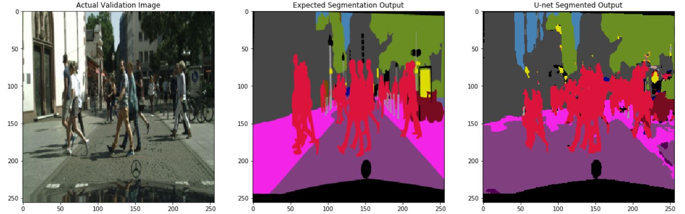
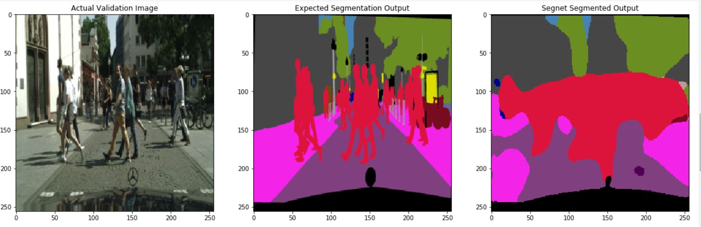
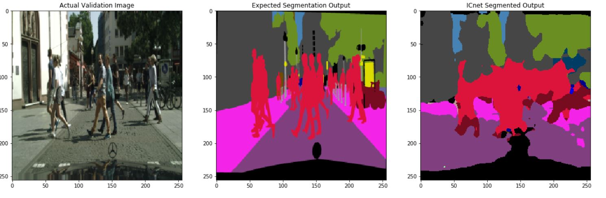
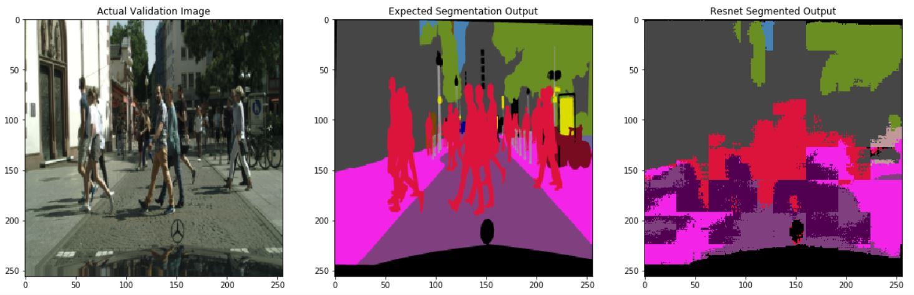
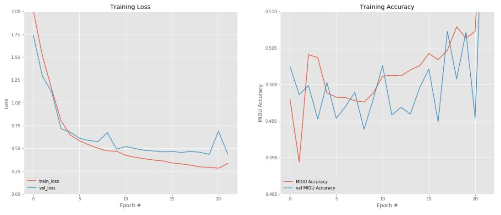
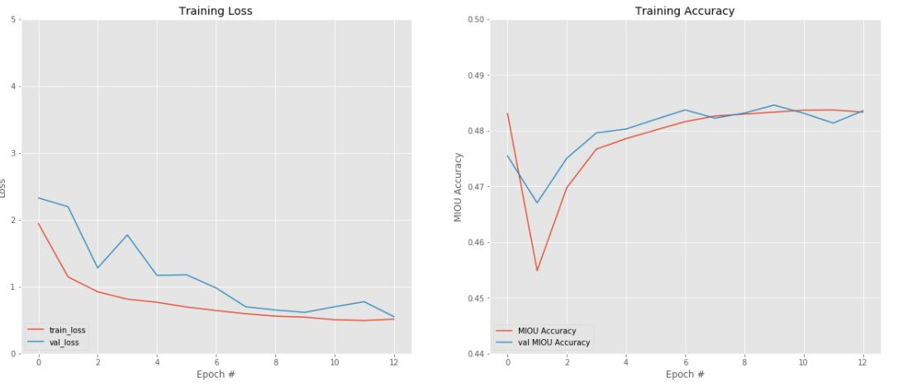
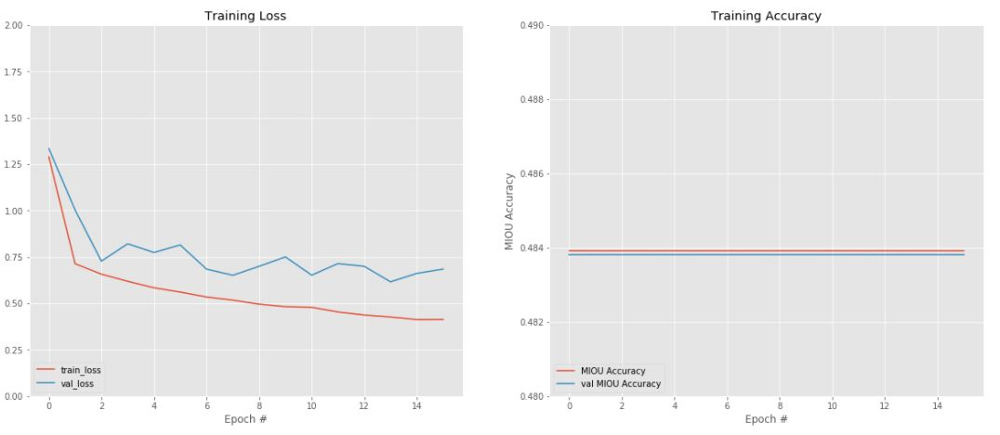
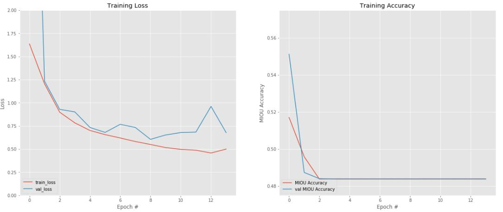
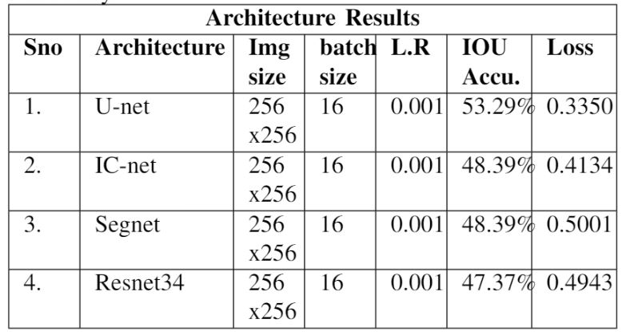

# Semantic_Segmentation

In this project, architectures like U-net, Segnet, IC-net and Resnet are implemented for the purpose of semantic segmenatation.

## Dataset used for Training and Testing:
The architectures were trained on Cityscrapes dataset.
The datasets used can be downloaded from this [link](https://www.cityscapes-dataset.com/downloads/). Please download gtFine_trainvaltest.zip (241MB) [md5] for labels and leftImg8bit_trainvaltest.zip (11GB) [md5] for images.

## Software Requirements:
1. Python version - 3.8
2. Tensorflow 2.2.0
3. Jupyter notebook

## Hardware Requirements:
The architectures were trained with AWS support and making using S3 bucket cloud storage to store the dataset and Sagemaker service to launch the jupyter notebook with high performance GPU. The details of the GPU used is given below:

1. GPU name : Tesla 1xK80
2. Instance type: ml.p2.x.large
3. number of vCPUs : 4
4. RAM : 61 GB
5. GPU Memory : 12 GB

## Running the code:
In order to run the code, first AWS account should be set up. Then, the user needs to request for ml.p2.x.large instance as AWS does not provide GPU by default for its user. A mail stating the usage and requirement for the GPU need to be sent to AWS service team and within 48 hours, 1 ml.p2.x.large instance will be granted to the user.

### Running Jupyter notebook on Sagemaker:
Please follow the below steps to run the code:

1. Login into your AWS console using this [link](https://signin.aws.amazon.com/signin?redirect_uri=https%3A%2F%2Fconsole.aws.amazon.com%2Fconsole%2Fhome%3Fnc2%3Dh_ct%26region%3Dus-east-1%26src%3Dheader-signin%26state%3DhashArgs%2523%26isauthcode%3Dtrue&client_id=arn%3Aaws%3Aiam%3A%3A015428540659%3Auser%2Fhomepage&forceMobileApp=0&code_challenge=gCL-BkIH980B_IBYQ56P7P9oErtYzzUER4s0aNvf4tM&code_challenge_method=SHA-256)

2. Search for AWS Sagemaker in Find Services.

3. On the left side, click on Notebook Instances.

4. Click on 'Create notebook instance' button on the right side.

5. Give a name to the notebook instance and in Additional configuration increase the volume size to 50 GB.

6. Change the notebook instance type to ml.p2.x.large instance.

7. In the github repositories option, choose the option 'Clone a public Git repository to this notebook instance only'.

8. On the Git reposity URL paste the following URL:https://github.com/Eashwar-S/Semantic_Segmentation.git

9. Click 'create notebook instance' button.

10. If you face an error mentioning 'limit' then probably GPU instance has been allocated for your account. Please request AWS service to grant ml.p2.x.large instance.

11. Lanuching of instance will take 1-2 minutes. 

12. After the notebook instance is launched, click on Open Jupyter notebook and it will launch a jupyter notebook on a separate tab which will contain all the files cloned from this repository.

## Results obtained:
The following are the segmented results obtained from U-net, IC-net, Segnet and Resnet architectures respectively for the same input image:

#### U-net Segmented Output:

#### Segnet Segmented Output:

#### IC-net Segmented Output:

#### Resnet Segmented Output:

#### U-net mIOU accuracy and loss graph:

#### Segnet mIOU accuracy and loss graph:

#### IC-net mIOU accuracy and loss graph:

#### Resnet mIOU accuracy and loss graph:

### Architecture Comparison:
Of all the architectures, U-net performed the best with mIOU accuracy of 53.29%.

