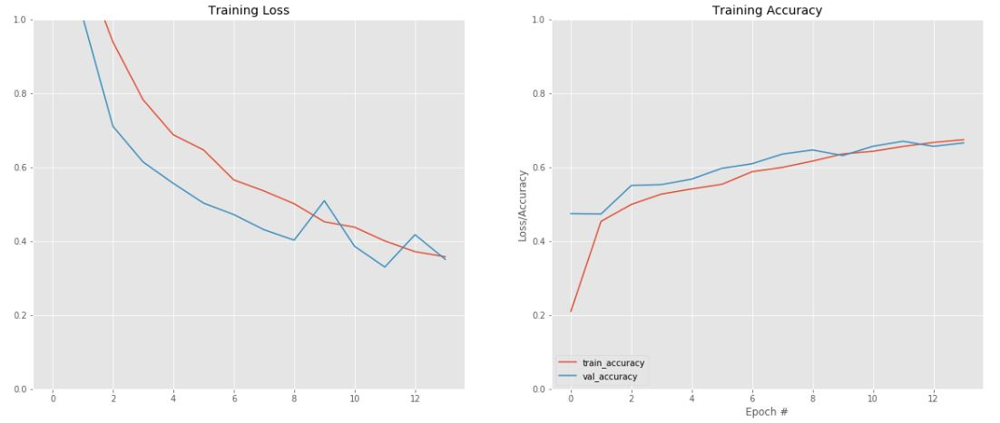

# Semantic_Segmentation

In this project, semantic segmentation is done using U-net. U-net is popularly used convolutional neural net for semantic segmentaation.

## Dataset used for Training and Testing:
The dataset was obtained from Kaggle.com. The datasets used can be downloaded from this [link](https://www.kaggle.com/c/data-science-bowl-2018/data).

## U-net:
The following is the architecture of U-net used to perform Semantic Segmentation.


## Directory Structure:
After downloading and extracting the dataset and all the follders inside it, change the name of the folder from "data-science-bowl-2018" to "dataset". The final directory structure should look like:
```
Semantic_Segmentation:
    |
    |-----> Unet.ipnb
    |
    |-----> dataset
    |          |
    |          |----> stage1_test
    |          |----> stage1_train
    |
    |
    |------> NPY files
    |------> LICENSE
    |------> images
    |------> Output
    |------> README.md
    |------> logs
```

## Model training and accuracy:
U-net model was implemeted using tensorflow. The model accuracy and model loss was analysed using tensor board and following are the graphs:

Accuracy increase with increase in number of EPOCHS.


Loss decreases with increase in number of EPOCHS.


The tensor board outputs can be viewed by clicking this [link](http://localhost:8099/#scalars&runSelectionState=eyJ0cmFpbiI6dHJ1ZSwidmFsaWRhdGlvbiI6dHJ1ZX0%3D)
## Output Images:
The following are few output images obtained from U-net model after training. The left side shows the input image with bacteria. The right side shows the segmented output obtained from U-net highlighting the bacteria.


The following gifs shows the shows the segmentation of bacteria.  


## Implementation of multi-class semantic segmentation
Multiclass sematic segmentation is performed by segmenting 32 classes avilable from Camvid dataset. The dataset can be accessed from [here](https://www.kaggle.com/jcoral02/camvid).

### Output
The folllowing are the ouputs obtained:


Model Training Loss and Accuracy:




### Installing Anaconda
1. To install anaconda please click [here](https://www.anaconda.com/products/individual)

2. Scoll down and go to "Anaconda Installers" and choose the approriate installation according to the computer specifications.

3. During Installations, there is no need to change anything just click next and finish.

### Installing libraries

1. On window apps, search for "Anaconda Navigator" and open it.

2. On the left side, go to Environments.

3. By default, on search environments we will find the environment as base(root). We need to create a new environment.

3. On the bottom left, please click Create which creates a new environment. Name it as "tensorflow".

4. A new "tensorflow" environment will be added below base(root).

5. Select "tensorflow" environment and on the right side we find all the packages installed on the environment.

6. Change the option to show All from only installed packages.

7. Now click 'Update index' once.

8. Search for tensorflow in search packages.

if your computer has a gpu, please select 'tensorflow-gpu' or else just 'tensorflow' and click Apply.

Tensorflow package will be installed in 'tensorflow' environment.

9. Similarly search for the following packages in search packages and click Apply.

a. opencv
b. tqdm
c. numpy
d. matplotlib
e. xlrd
f. pillow
g. scikit-image

### Installing Jupyter Notebook

1. After installing all packages, please go to Home in Anaconda Navigator from Environments.

2. Find Jupyter Notebook and cick install

3. After installation close the Anaconda navigator

### Cloning the repository
Please execute the following commands on the command prompt.
```
cd 'to desired directory'
git clone https://github.com/Eashwar-S/Semantic_Segmentation

```
### Dowloading datasets

1. After cloning the repository create a folder inside the repository called 'dataset'.

2. Download the dataset zip file from this [link](https://drive.google.com/drive/folders/19RD0j9CyTw3lixXQlFpOmm-iFg1ruE8Y?usp=sharing).

3. Extract the file. The final structure should look like this.
```
dataset
    |
    |---> bdd100k_seg
            |
            |-----> color_labels
            |-----> images
            |-----> labels.py
```

### Opening on jupyter notebook
1. Open 'Anaconda Prompt' from windows app. Execute the following command.
```
activate tensorflow
```

2. Navigate to the directory where the repository is cloned the repository.
```
cd Semantic_Segmentation
jupyter notebook
```