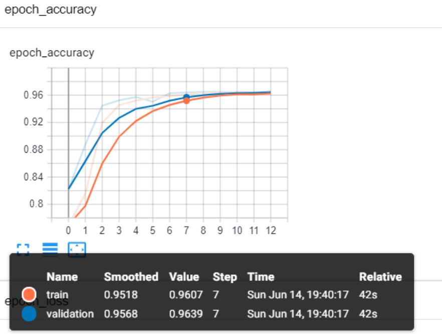
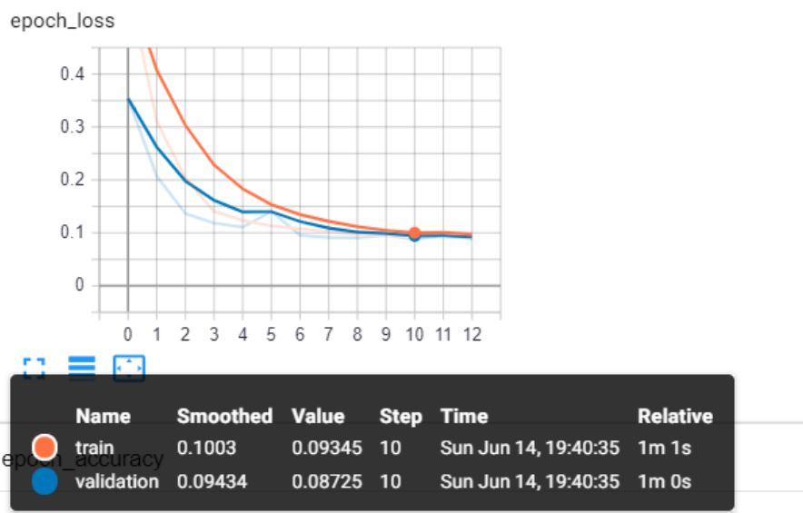

# Semantic_Segmentation

In this project, semantic segmentation is done using U-net. U-net is popularly used convolutional neural net for semantic segmentaation.

## Dataset used for Training and Testing:
The dataset was obtained from Kaggle.com. The datasets used can be downloaded from this [link](https://www.kaggle.com/c/data-science-bowl-2018/data).

## U-net:
The following is the architecture of U-net used to perform Semantic Segmentation.


## Directory Structure:
After downloading and extracting the dataset and all the follders inside it, change the name of the folder from "data-science-bowl-2018" to "dataset". The final directory structure should look like:
```
Semantic_Segmentation:
    |
    |-----> Unet.ipnb
    |
    |-----> dataset
    |          |
    |          |----> stage1_test
    |          |----> stage1_train
    |
    |
    |------> NPY files
    |------> LICENSE
    |------> images
    |------> Output
    |------> README.md
    |------> logs
```

## Model training and accuracy:
U-net model was implemeted using tensorflow. The model accuracy and model loss was analysed using tensor board and following are the graphs:

Accuracy increase with increase in number of EPOCHS.


Loss decreases with increase in number of EPOCHS.


The tensor board outputs can be viewed by clicking this [link](http://localhost:8099/#scalars&runSelectionState=eyJ0cmFpbiI6dHJ1ZSwidmFsaWRhdGlvbiI6dHJ1ZX0%3D)
## Output Images:
The following are few output images obtained from U-net model after training. The left side shows the input image with bacteria. The right side shows the segmented output obtained from U-net highlighting the bacteria.


The following gifs shows the shows the segmentation of bacteria.  


